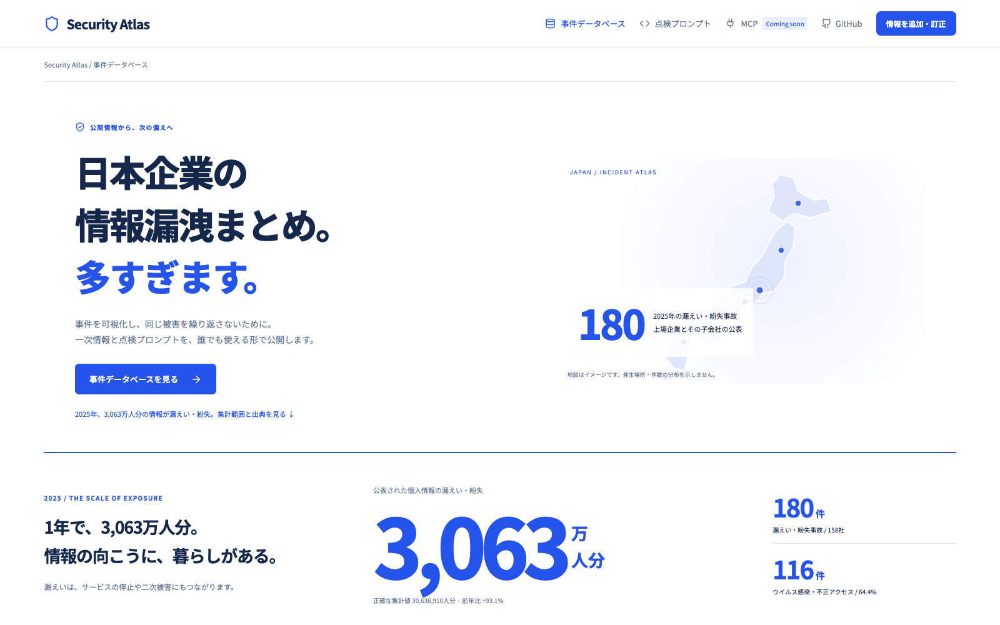
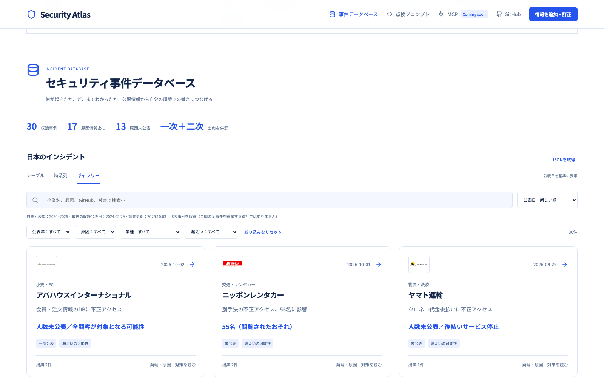

<div align="center">

# Security Atlas

### 日本企業の情報漏洩まとめ。多すぎます。

事件を可視化し、同じ被害を繰り返さないために。<br>
一次情報・原因の整理・点検プロンプトを、誰でも使える形で公開します。

[サイトを見る](https://securityatlas.org/) · [情報を追加する](https://github.com/chaenmasahiro0425/security-atlas/issues/new/choose) · [点検プロンプト](PROMPTS.md) · [編集に参加する](CONTRIBUTING.md)

</div>



## まず、事件を知る

| 見たいこと | 使い方 |
| --- | --- |
| 多くの事件を一覧で見る | テーブル：1行で公表日・原因・影響・出典を比較 |
| 企業ごとに読み始める | ギャラリー：ロゴ・影響を見てカードを開く |
| 経緯を追う | 時系列：公表日順に並べる |
| 自分に関係する事件を探す | 企業名・業種・年度・漏えい状況・原因の公表状況で検索 |
| 詳細を読む | 全画面で発端・図解・わかったこと・未公表事項・一次資料を確認 |
| 自分のコードを点検する | 各事件の「対策・プロンプト」をClaude Code等にコピー |



## 公開データの範囲

2026年10月3日確認。公表年2024〜2026の代表事例30件を収録しています。最古の収録公表日は2024年5月29日。全国全件の網羅ではありません。

公表日・発生日・検知日を分け、確認された漏えいと漏えいのおそれを区別します。未公表の原因は断定しません。資料の続報、人数・件数・アカウント数の違い、重複する対象を確認して記録します。

トップの年間統計は、東京商工リサーチによる2025年の上場企業・子会社の公表調査です。事故180件・158社、漏えい・紛失3,063万人分。全国すべての事故や重複を除いた被害人数ではありません。[集計範囲・一次資料](https://www.tsr-net.co.jp/data/detail/1202348_1527.html)

[追加調査の出典と判断](docs/research-20261003.md) · [ロゴの出典](docs/logo-sources.md)

## みんなで、次の被害を減らす

公開資料を見つけたら、[追加・訂正のIssue](https://github.com/chaenmasahiro0425/security-atlas/issues/new/choose)へ。組織名、公表日、公式発表のURL、追加・訂正内容をお知らせください。編集者が根拠を確認して反映します。自動反映ではありません。

個人情報、秘密情報、非公開資料は投稿しないでください。[編集方針・PRの手順](CONTRIBUTING.md)に沿って、公開データと点検プロンプトへの改善提案を受け付けます。

点検プロンプトも公開しています。各事件から学べる確認項目を追加・改善していきます。実コードの根拠を確認する読み取り専用レビューから始めてください。

## MCP：Coming soon

事件検索・一次情報の取得・点検観点の参照を、AIから利用できるMCPとして提供することを目指しています。現在は計画段階で、接続先や利用可能なMCPサーバーはありません。進捗と提案はGitHubで共有します。

## ローカルで動かす

Node.js 22以上。

```sh
npm ci
npm run dev
```

`http://127.0.0.1:3182` で表示。検索条件・ビュー・事件IDはURLで共有できます。

```sh
npm test
npm run build
npx playwright install chromium
npx playwright test tests/ui.spec.ts tests/experience.spec.ts tests/legal.spec.ts --workers=2
```

E2E実行には開発サーバーが必要です。検索、年度、ギャラリー、共有URL、JSON取得、全画面と前後移動、キーボード、320〜1440pxの画面幅、データ読込失敗、起票文、規約モーダルの再読込とキーボード操作を確認します。

## データの構成

| ファイル | 内容 |
| --- | --- |
| `public/data/incidents.json` | 初期11事例 |
| `public/data/research.json` | 初期事例の一次情報・二次情報・点検観点 |
| `public/data/additions-20261003.json` | 2026年の追加10事例 |
| `public/data/history-2024-2025.json` | 2024〜2025年の追加9事例 |

検索はブラウザ内で行います。アクセス解析・ログイン・独自の個人情報収集はありません。Google Fontsは外部配信です。自動収集・自動更新は未実装。資料の続報により掲載情報が変わることがあります。

## ライセンス

コード：MIT（[LICENSE](LICENSE)）。独自編集データ：CC BY 4.0（[DATA-LICENSE.md](DATA-LICENSE.md)）。企業ロゴ、公式資料、リンク先の図版・文章の権利は各権利者に帰属します。提携や推奨を意味しません。

個人運営のオープンな学習プロジェクトです。調査の入口：[piyolog](https://piyolog.hatenadiary.jp/) / [Socket Blog](https://socket.dev/blog)
